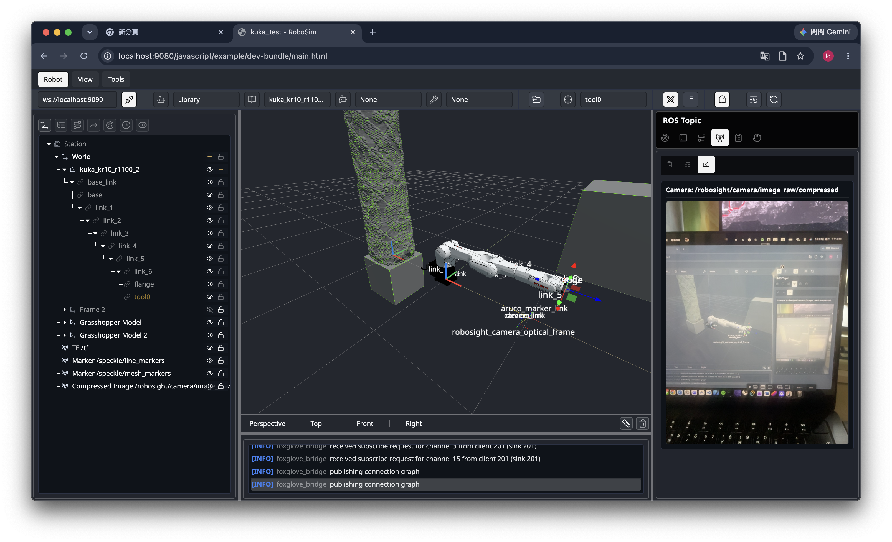

# RoboSight

RoboSight 是用於驗證 iOS 裝置作為 ROS 2 外部感測器的 App。
目前已完成 Zenoh 連線與相機影像串流。

## 目前功能

- iOS App 連線到 ROS 2 Zenoh router
  - 發送 `/robosight/status`
- 相機功能
  - 發送 `/robosight/camera/image_raw/compressed`
  - 發送 `/robosight/camera/camera_info`
  - 相機影像固定以直式 portrait 輸出

### RoboSight 
| Start Page | Camera | Robot |
|---|---|---|
| ||  |

### ROS integration on [roboSim](https://github.com/Avery320/robot-demo)


## App 設定

### Xcode Simulator：

```text
Router Address: 127.0.0.1
Router Port: 7447
Domain ID: 0
```

### 實體裝置：

```text
Router Address: <Mac 或 ROS Docker host 的區網 IP>
Router Port: 7447
Domain ID: 0
```

注意：Xcode Preview 只適合檢查 UI，不能用來驗證 ROS 連線。請使用 Xcode Run 啟動 Simulator 或實體裝置。

## ROS 2 Setup

### Install Zenoh RMW：
```bash
apt-get update
DEBIAN_FRONTEND=noninteractive apt-get install -y ros-jazzy-rmw-zenoh-cpp
```

### 啟動 Zenoh router：
```bash
source /opt/ros/jazzy/setup.bash
export RMW_IMPLEMENTATION=rmw_zenoh_cpp
export ROS_DOMAIN_ID=0
ros2 run rmw_zenoh_cpp rmw_zenohd
```

### Test：
```bash
source /opt/ros/jazzy/setup.bash
export RMW_IMPLEMENTATION=rmw_zenoh_cpp
export ROS_DOMAIN_ID=0

ros2 topic info /robosight/status --verbose
ros2 topic echo /robosight/status std_msgs/msg/String
ros2 topic hz /robosight/camera/image_raw/compressed
ros2 topic hz /robosight/camera/camera_info
```

### Rviz2：
```bash
source /opt/ros/jazzy/setup.bash
export RMW_IMPLEMENTATION=rmw_zenoh_cpp
export ROS_DOMAIN_ID=0
rviz2
```
